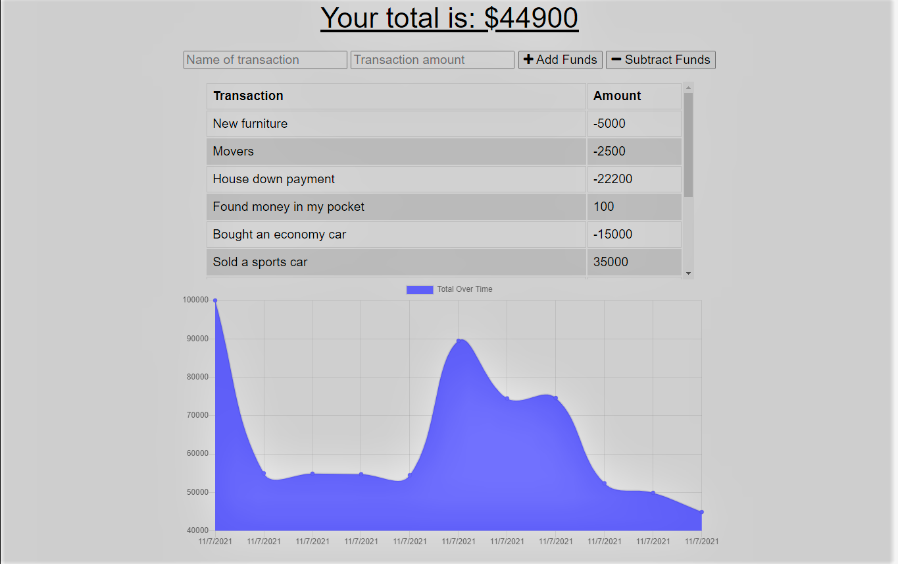

# Devin's Budget-Tracker
Week 19 Homework

## Description

This is a simple budget tracker app that is able to keep track of deposits and withdrawals while off line and will update your information upon reconnecting to the internet. This is accomplished using IndexedDB to store the users information until the network access is restored. 

## User Story

```md
AS AN avid traveller I WANT to be able to track my withdrawals and deposits with or without a data/internet connection SO THAT my account balance is accurate when I am traveling
```

## Business Context

Giving users a fast and easy way to track their money is important, but allowing them to access that information anytime is even more important. Having offline functionality is paramount to our applications success.

## Access to app

[Deployed link](https://devins-budget-tracker.herokuapp.com/)

[Repo Link](https://github.com/DMosca2021/dm_Budget-Tracker)

## How to install locally. 

- Clone Repo
- npm install all packages
- npm start, will run a prestart script to create the dist folder and associated files

## Example of app



